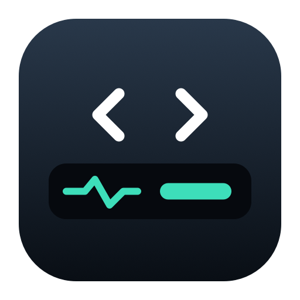

<p align="center">
  
</p>

# Codex TouchBar Monitor

English | [简体中文](README.zh-CN.md)

A native Swift/AppKit background app for macOS that displays network latency, remaining weekly Codex quota, task activity, and questions awaiting a reply on the Touch Bar.

An independent community project, not affiliated with, sponsored by, or officially supported by OpenAI or Apple.

Current version: [v1.1.4 (prerelease)](https://github.com/Luyzr/CodexTouchBarMonitor/releases/tag/v1.1.4).

## Requirements and installation

- macOS 13 or later, Apple Silicon.
- A Mac with a physical Touch Bar for Touch Bar controls. Other Macs can use the desktop status window.
- Codex Desktop for task monitoring; remote tasks require an active Desktop connection to the remote device.

1. Download `CodexTouchBarMonitor-arm64.zip` and `SHA256SUMS` from [Releases](https://github.com/Luyzr/CodexTouchBarMonitor/releases).
2. Verify the download in the directory containing both files:

   ```sh
   shasum -a 256 -c SHA256SUMS
   ```

3. Unzip and move **CodexTouchBarMonitor.app** to Applications, then open it.
4. Closing the status window keeps the app running. Use the **CTB** menu bar item for tasks, settings, and quitting. There is no Dock icon; opening the app again restores the window.

Current packages are ad-hoc signed, without a Developer ID signature or Apple notarization. If macOS blocks a download you trust, use **Open Anyway** in Privacy & Security. Do not disable system security protections.

## Touch Bar controls

- The persistent right-side tile shows network latency above the Codex icon and remaining weekly quota. It stays available when Codex is closed and marks unavailable or stale data.
- Single-tap the tile to open or activate Codex.
- Double-tap to open the task area. The system **X** restores the foreground app's native controls; double-tap again to reopen the task area.
- A yellow circle indicates running work, a flashing yellow triangle with a black exclamation mark indicates a pending question, and green indicates completion.
- Choose predefined answers directly. Use **Open Codex** for free-text replies; Touch Bar text entry and Chinese IME support are currently paused.
- The task area temporarily replaces the foreground app's Touch Bar controls without switching the foreground app.

## Quota account and settings

Open **CTB → Settings** to choose English or Chinese, configure refresh intervals, display options, task count, notifications, and launch at login. Advanced settings include the Codex executable, bundle ID, and service socket.

Use **Quota Account…** to link a separate account for the quota display. Complete the OpenAI sign-in flow and verify the selected account, especially if the browser retains an existing login. The account must expose readable ChatGPT weekly quota.

This changes only the quota source. It does not sign out of Codex Desktop, switch its account, or change task monitoring. Cancellation or failure preserves the previous source; restoring the current Codex account removes the independent binding. Credentials live in this app's separate local application-support directory and are not copied over Codex's login files or written to logs, the repository, or release packages.

## How it works and known limits

Network and quota monitoring run independently of task monitoring. Tasks use local Codex Desktop IPC events, supplemented by read-only catalog discovery, including remote devices already connected to Desktop. Remote task titles include a device identifier. Discovery runs at launch, when leaving Codex, on manual refresh, and every 30 seconds; events update task state.

The app supports synchronous input/approval requests and asynchronous questions. Replies are checked against task, turn, request, and connection identity. Unconfirmed replies are not blindly retried.

Compatibility depends on private macOS Touch Bar APIs and internal Codex Desktop protocols, which can change. Remote running/completed events have been verified; a complete real remote approval flow, device reconnection, and prolonged sleep recovery still require dedicated acceptance testing. Historical designs and validation records are in [docs](docs); this README and release notes describe the current behavior.

## Build and test

Use macOS with Xcode Command Line Tools supporting Swift 5.9 or later. Build on your designated build machine; testing Macs may run the packaged app. Create a local, untracked build-host configuration after cloning:

```sh
mkdir -p work
python3 - <<'CONFIG'
import json, pathlib, socket
pathlib.Path('work/build-host.json').write_text(json.dumps({
    'hostname': socket.gethostname().split('.')[0],
    'root': str(pathlib.Path.cwd().resolve())
}))
CONFIG
bash scripts/test.sh
bash scripts/build.sh
python3 scripts/prepare_release.py
```

Build scripts validate the configured host and repository directory. Developer-specific paths are not included in source or release packages. Automated tests use fictional tasks and do not require a physical Touch Bar. Native UI checks require a graphical macOS login session. `bash scripts/test.sh --live` additionally performs read-only service connection checks.

Artifacts are written to `dist`: the app, ZIP, `SHA256SUMS`, and a Homebrew Cask. `scripts/sign_release.sh` can use an existing Developer ID and notarization configuration; keep credentials outside the repository. `scripts/publish_release.sh` creates a draft through an authenticated GitHub CLI. Check the version, tag, source, and artifacts before publishing.

If latency or quota data is missing, first check connectivity and the Codex login state.

## Contributing and security

Report reproducible, sanitized issues through [Issues](https://github.com/Luyzr/CodexTouchBarMonitor/issues). See [CONTRIBUTING.md](CONTRIBUTING.md) for development guidance and [SECURITY.md](SECURITY.md) for sensitive reports. Never attach credentials, real task contents, or raw IPC logs to a public issue.

## License

[MIT](LICENSE). You may use, modify, and redistribute this project's own code and documentation, including commercially, while retaining the copyright and license notices. This grant also covers this project's historical releases distributed here. Third-party software and trademarks remain subject to their owners' terms.
